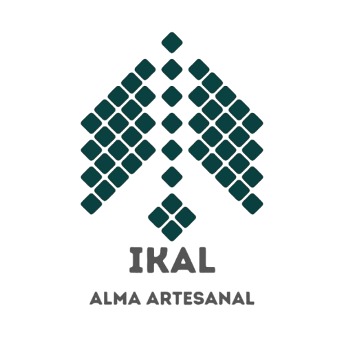

# IKAL
---



## Plataforma digital para la comercialización de artesanías regionales
---
IKAL es una plataforma web regional enfocada en la comercialización de artesanías elaboradas por artesanos de Xicotepec y Pantepec, facilitando el comercio justo y eliminando intermediarios.

El proyecto busca conectar directamente a los artesanos con compradores interesados en adquirir productos regionales a un precio justo, reduciendo la participación de intermediarios que pueden comprar las artesanías a precios bajos para posteriormente revenderlas a turistas a precios considerablemente mayores.

---

# Propósito del proyecto

El propósito de IKAL es desarrollar una plataforma web regional que permita a artesanos de Xicotepec y Pantepec comercializar sus productos de manera directa, reduciendo la participación de intermediarios y facilitando el acceso a compradores interesados en adquirir artesanías a un precio justo.

La plataforma busca ampliar el mercado de los artesanos mediante herramientas digitales que permitan publicar y administrar productos, establecer comunicación directa con los compradores, realizar pagos en línea y consultar información sobre sus ventas.

Además, IKAL busca promover las artesanías de la región y dar mayor visibilidad a los productos locales, incluyendo propuestas innovadoras como artesanías con realidad aumentada en sus bordados.

---

# Objetivo general del proyecto

Procesar, analizar e interpretar información del negocio mediante herramientas y metodologías de analítica de datos, con la finalidad de identificar tendencias, patrones, métricas e indicadores clave que apoyen la toma de decisiones.

---

# Flujo general de trabajo

El proyecto seguirá un flujo de trabajo basado en las siguientes etapas:

**Contexto del negocio**  
↓  
**Problema y preguntas de negocio**  
↓  
**Entidades, atributos y fuentes de datos**  
↓  
**Simulación estratégica del dataset**  
↓  
**Proceso ETL**  
↓  
**Análisis exploratorio de datos**  
↓  
**Mecanismo analítico**  
↓  
**Definición de KPI**  
↓  
**Dashboard del dueño**  
↓  
**Dashboard del cliente**  
↓  
**Diagnóstico y recomendaciones**  
↓  
**Documentación, GitHub y defensa**

---

# Etapas del proyecto

## Etapa 1. Contexto, problemática y objetivos analíticos

### 1.1 Descripción del negocio

IKAL es una plataforma web regional enfocada en la comercialización de artesanías elaboradas por artesanos de Xicotepec y Pantepec.

La plataforma permite que los artesanos se registren, administren su perfil y publiquen, editen o eliminen sus productos.

Los compradores pueden consultar y filtrar las artesanías de acuerdo con diferentes características, como tipo de bordado, color, categoría del producto, ropa o accesorio.

IKAL también permite la comunicación directa entre compradores y artesanos mediante un chatbot y ofrece la posibilidad de realizar pagos con tarjeta.

Los artesanos pueden consultar información relacionada con sus ventas, productos más y menos vendidos, ingresos y número de pedidos.

La plataforma cuenta además con un perfil administrativo desde el cual se puede supervisar la información de los artesanos, consultar su procedencia y gestionar usuarios que no cumplan con los requisitos establecidos.

Como parte de su propuesta, las creadoras de IKAL también participan como artesanas dentro de la plataforma, ofreciendo productos que incorporan realidad aumentada en sus bordados.

El modelo de negocio contempla diferentes fuentes de ingresos, entre ellas la venta de productos, anuncios y colaboraciones.

---

### 1.2 Problema

Los artesanos de Xicotepec y Pantepec pueden tener dificultades para comercializar sus productos directamente con consumidores interesados en adquirir artesanías a un precio justo.

La participación de intermediarios puede provocar que los productos sean adquiridos a precios bajos y posteriormente revendidos a turistas a precios considerablemente mayores.

Esta situación puede limitar el alcance comercial de los artesanos y reducir los beneficios económicos obtenidos por su trabajo. Además, la falta de canales digitales especializados puede dificultar que sus productos lleguen a compradores fuera de su entorno local.

Por ello, IKAL busca proporcionar un espacio digital que permita conectar directamente a artesanos y compradores, ampliar el mercado de las artesanías regionales y facilitar que los productores tengan mayor control sobre la comercialización de sus productos.

---

### 1.3 Stakeholders

| Stakeholder | Interés o participación |
|---|---|
| Artesanos | Publicar y vender sus productos, administrar su perfil y consultar sus ventas. |
| Compradores | Buscar, filtrar y comprar artesanías directamente a los productores. |
| Administradores de IKAL | Supervisar usuarios, productos y funcionamiento de la plataforma. |
| Turistas | Encontrar y adquirir artesanías regionales directamente de los artesanos. |
| Colaboradores y anunciantes | Promocionar productos o servicios dentro de la plataforma. |
| IKAL | Facilitar la comercialización y obtener ingresos mediante ventas, anuncios y colaboraciones. |

---

### 1.4 Preguntas de negocio

1. ¿Cuáles son los productos más vendidos en IKAL?
2. ¿Cuáles son los productos menos vendidos?
3. ¿Qué artesanos generan mayores ingresos?
4. ¿Cómo varían las ventas a lo largo del tiempo?
5. ¿Qué categorías de productos tienen mayor demanda?
6. ¿De qué localidades provienen los artesanos registrados?
7. ¿Cuántos pedidos y cuánto ingreso genera la plataforma?
8. ¿Qué características de los productos tienen mayor relación con su nivel de ventas?

---

### 1.5 Objetivo analítico

Analizar los datos de IKAL relacionados con artesanos, productos, pedidos y ventas para identificar tendencias, patrones y características asociadas al comportamiento comercial de la plataforma, con el fin de generar indicadores y hallazgos que permitan evaluar su desempeño y apoyar la toma de decisiones.

---

## Antecedentes de diseño — Preguntas HMW

Como parte del proceso previo de diseño de IKAL se plantearon preguntas HMW (How Might We) para orientar la ideación de la plataforma:

- ¿Cómo podríamos hacer que las artesanas publiquen sus bordados sin necesidad de conocimientos técnicos avanzados?
- ¿Cómo podríamos generar confianza entre compradores que no conocen a la artesana en persona?
- ¿Cómo podríamos hacer que cada compra se sienta como una conexión cultural, no solo una transacción?
- ¿Cómo podríamos facilitar los pagos en línea para compradores y artesanas en zonas con acceso limitado a bancos?
- ¿Cómo podríamos ayudar a las artesanas a contar la historia detrás de cada pieza?

Estas preguntas sirvieron como antecedentes para definir algunas de las funcionalidades y características de IKAL.

---

# Etapa 2. Entidades, atributos, fuentes y diccionario de datos

## 2.1 Entidades principales

| Entidad | Descripción |
|---|---|
| Artesano | Persona que se registra y comercializa sus productos en IKAL. |
| Producto | Artesanía publicada dentro de la plataforma (propia o de artesano). |
| Comprador | Persona que consulta y adquiere productos. |
| Venta | Transacción que registra producto, comprador, pago y estado en un solo evento. |
---

## 2.2 Atributos principales

### Artesano — `artesanos_corregido.csv`

| Campo | Tipo | Descripción |
|---|---|---|
| artesano_id | Entero | Identificador único del artesano |
| nombre | Texto | Nombre completo |
| ubicacion | Texto | Xicotepec de Juárez o Pantepec |
| fecha_registro | Fecha | Fecha de alta en la plataforma |
| productos_publicados | Entero | Cantidad de productos activos del artesano |
| unidades_vendidas | Entero | Total de piezas vendidas de sus productos |
| ingresos_generados | Decimal | Suma de ingresos de sus productos |
| utilidad_generada | Decimal | Ingresos menos costo de producción |

### Producto — `productos_corregido.csv`

| Campo | Tipo | Descripción |
|---|---|---|
| producto_id | Entero | Identificador único del producto |
| nombre | Texto | Nombre del producto |
| tipo | Texto | "Marca IKAL" o "Artesano" |
| categoria | Texto | Playera, Bolsa, Aretes, Accesorio, Bordado, Blusa |
| artesano_id | Entero | Referencia al artesano (0 = Marca IKAL) |
| precio_venta | Decimal | Precio al público |
| costo | Decimal | Costo de producción |
| unidades_vendidas | Entero | Total vendido (calculado desde ventas) |
| ingreso_total | Decimal | Ingreso generado por el producto |
| utilidad_total | Decimal | ingreso_total − (costo × unidades_vendidas) |

### Comprador — `compradores_corregido.csv`

| Campo | Tipo | Descripción |
|---|---|---|
| comprador_id | Entero | Identificador único del comprador |
| nombre | Texto | Nombre completo |
| ubicacion | Texto | Ciudad de residencia |
| fecha_registro | Fecha | Fecha de alta en la plataforma |
| num_compras | Entero | Total de compras realizadas (calculado desde ventas) |
| total_gastado | Decimal | Suma gastada en la plataforma (calculado desde ventas) |

### Venta — `ventas_corregido.csv`

| Campo | Tipo | Descripción |
|---|---|---|
| venta_id | Entero | Identificador único de la venta |
| producto_id | Entero | Referencia al producto vendido |
| comprador_id | Entero | Referencia al comprador |
| ubicacion_comprador | Texto | Ubicación del comprador al momento de la venta |
| fecha_venta | Fecha | Fecha de la transacción |
| cantidad | Entero | Piezas compradas |
| metodo_pago | Texto | Crédito o Débito |
| total | Decimal | precio_venta × cantidad |
| tipo_producto | Texto | "Marca IKAL" o "Artesano" |
| canal | Texto | Web, Instagram, Facebook o WhatsApp |
| estatus | Texto | Entregado, Enviado, En preparación o Cancelado |

---

## 2.3 Fuentes de datos

Debido a que IKAL es un proyecto de reciente creación y actualmente no cuenta con un
historial amplio de operaciones reales, se utilizaron **datos simulados** con reglas
de negocio explícitas (estacionalidad, crecimiento anual, coherencia referencial),
autorizado como parte de esta fase del proyecto.

| Fuente | Tipo | Uso |
|---|---|---|
| artesanos_corregido.csv | Simulado | Información de artesanos y sus métricas de venta |
| productos_corregido.csv | Simulado | Catálogo, precios, costos y desempeño por producto |
| compradores_corregido.csv | Simulado | Información de compradores y su historial |
| ventas_corregido.csv | Simulado | Transacciones: producto, comprador, pago, canal y estatus |

---

## 2.4 Diccionario de datos — resumen de reglas de validez

| Campo | Regla |
|---|---|
| *_id (todos) | Único, obligatorio, sin duplicados |
| fecha_registro (comprador) | Debe ser anterior a cualquier fecha_venta de ese comprador |
| costo | Siempre menor que precio_venta |
| total (ventas) | Debe ser igual a precio_venta × cantidad |
| artesano_id = 0 | Reservado exclusivamente para productos de Marca IKAL |
| metodo_pago | Solo "Crédito" o "Débito" |
| estatus | Solo "Entregado", "Enviado", "En preparación" o "Cancelado" |


---

# Etapa 3. Diseño y simulación estratégica del dataset
---
## 3.1 Reglas de negocio incorporadas

El dataset simula **3 años de operación** de IKAL (agosto 2023 – agosto 2026), con
reglas de negocio explícitas para que el comportamiento sea lógico y no aleatorio.

### Crecimiento de la plataforma
Como IKAL es un proyecto nuevo, la simulación refleja una **plataforma en crecimiento**:

| Elemento | Comportamiento simulado |
|---|---|
| Artesanos | Crecen de forma gradual, de pocos registros en 2023 a 60 en 2026 |
| Compradores | Crecen de forma más acelerada (típico de e-commerce), llegando a 900 |
| Productos | El catálogo aumenta con el tiempo: 30 Marca IKAL + 120 de artesanos |
| Ventas | Aumentan año con año: de apenas 67 en 2023 (arranque) a más de 1,600 en 2025 |

### Estacionalidad
Las ventas no son iguales todos los meses; se aplicó un factor de demanda según la
temporada, consistente con el contexto cultural mexicano:

| Periodo | Factor de demanda | Motivo |
|---|---|---|
| Noviembre–Diciembre | ×2.4 | Día de Muertos y temporada navideña |
| Mayo | ×1.8 | Día de las Madres |
| Enero–Febrero | ×0.6 | Temporada baja post-navideña |
| Resto del año | ×1.0 | Demanda base |

### Catálogo y precios
6 categorías (Playera, Bolsa, Aretes, Accesorio, Bordado, Blusa), cada una con un
rango de precio propio y un costo de producción entre 35% y 42% del precio de venta,
según la categoría — así se puede calcular utilidad real por producto.

### Canales y método de pago
Las ventas se distribuyen en 4 canales (Web, Instagram, Facebook, WhatsApp) y 2
métodos de pago (Crédito, Débito), con Web como canal principal.

## 3.2 Relaciones coherentes garantizadas

Estas reglas se validan matemáticamente en el propio script de generación:

- Ningún producto puede venderse antes de que su artesano se haya registrado.
- Ningún producto artesanal puede existir antes de la fecha de registro de su artesano.
- Ninguna venta puede ocurrir antes de que el comprador se haya registrado.
- El campo `total` de cada venta siempre es igual a `precio_venta × cantidad`.
- El costo de un producto siempre es menor que su precio de venta.
- Los totales de `num_compras`/`total_gastado` de cada comprador, y de
  `ingresos_generados` de cada artesano, se calculan **a partir de las ventas reales**,
  no se inventan por separado.

## 3.3 Problemas de calidad introducidos intencionalmente

Para poder demostrar el proceso de ETL (Etapa 4), se generó también una versión
"cruda" (`data/raw/`) con defectos de calidad controlados y documentados:

| Defecto | Tabla afectada | Cantidad |
|---|---|---|
| Valores nulos en ubicación | compradores | 2 registros |
| Registros duplicados | ventas | 3 registros |
| Categorías con mayúsculas inconsistentes | productos | 4 registros |
| Fechas en formato mixto (DD/MM/YYYY) | ventas | 5% de los registros |
| Nombres con espacios extra | artesanos | 3 registros |

Estos defectos se corrigen en el proceso ETL (ver Etapa 4), y la versión limpia se
guarda en `data/processed/`.

## 3.4 Reproducibilidad

El script usa semillas fijas (`np.random.seed(2026)` y `Faker.seed(2026)`), por lo que
ejecutarlo de nuevo produce exactamente el mismo dataset.

```bash
python src/simulation/generar_dataset.py
```

**Resultado de la última ejecución:**
- Artesanos: 60 (40 Xicotepec + 20 Pantepec)
- Compradores: 900
- Productos: 150 (30 Marca IKAL + 120 Artesano)
- Ventas: 3,614 (2023: 67 · 2024: 874 · 2025: 1,658 · 2026: 1,015)
- Ingreso total generado: $2,588,255.55 MXN
- Utilidad total generada: $1,566,814.17 MXN


