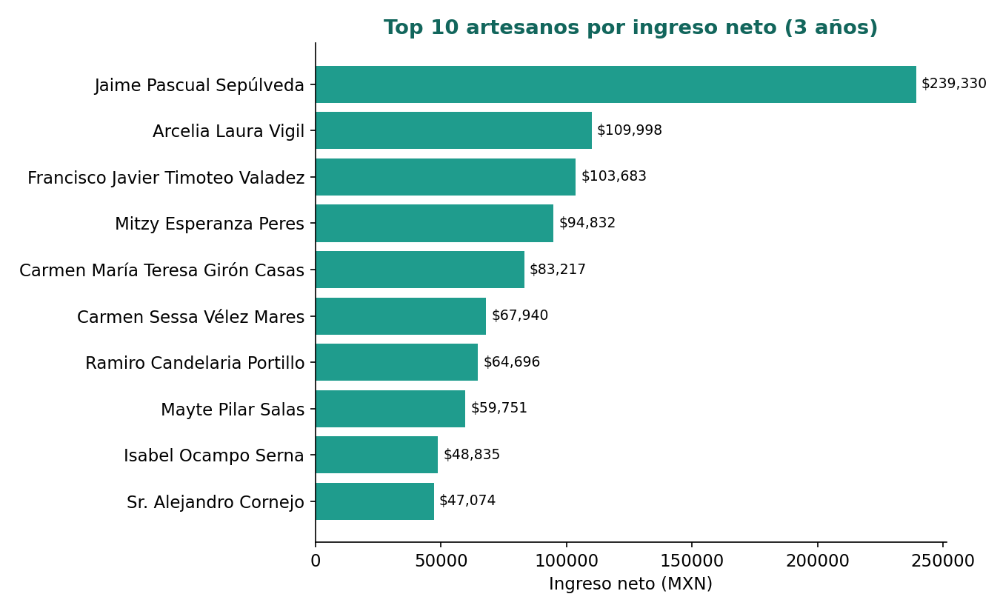
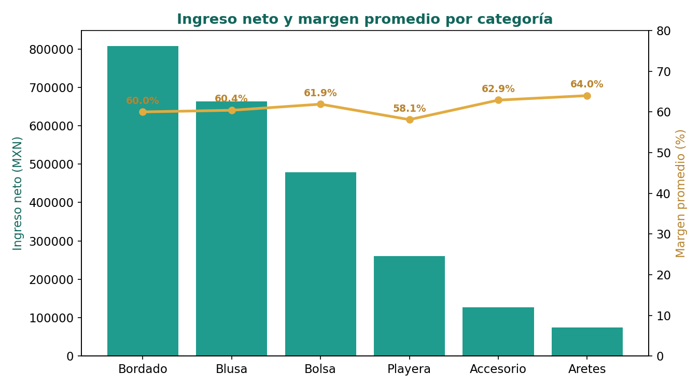
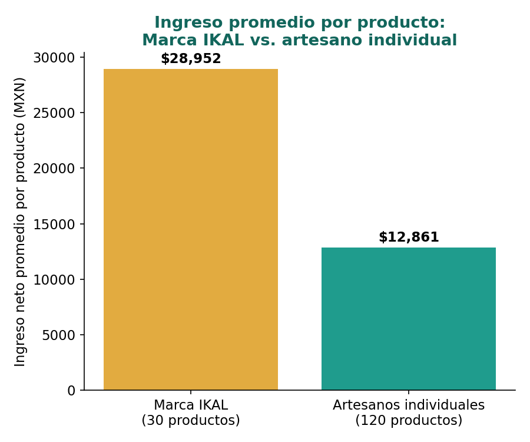
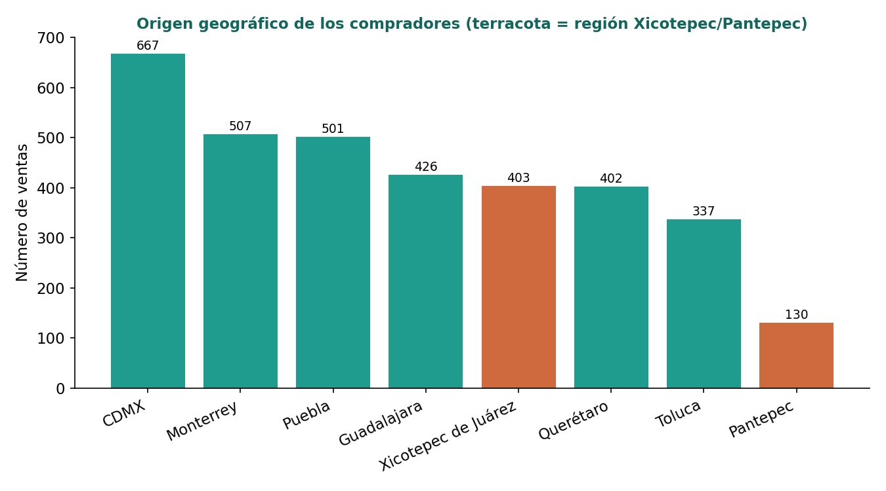

# Etapa 6 — Mecanismo Analítico de Diagnóstico

## 1. Justificación del método seleccionado

Se seleccionó como mecanismo analítico un **análisis de rentabilidad y equidad**, aplicado en tres niveles: por artesano individual, por comunidad de origen (Xicotepec de Juárez y Pantepec) y por categoría/técnica de producto, usando como referencia comparativa el desempeño de Marca IKAL (el grupo fundador que además de vender bordados propios administra la plataforma).

Este método se eligió por encima de otras opciones sugeridas para comercio electrónico (segmentación RFM, canasta de productos, pronóstico de ventas) porque responde directamente al objetivo central del negocio: IKAL no es un marketplace genérico, sino una plataforma creada para que artesanos de Xicotepec y Pantepec vendan **sin intermediarios**, conservando el 100% de su ganancia sobre el precio final, y para ampliar su mercado más allá del comprador turístico de temporada hacia compradores de todo el país.

Un análisis de rentabilidad y equidad permite verificar, con datos, si esa promesa de negocio se está cumpliendo: si el margen del artesano es consistente con la ausencia de intermediarios, si existen artesanos que no están beneficiándose de la plataforma, y si las ventas realmente provienen de fuera de la región.

## 2. Metodología y datos utilizados

### 2.1 Fuentes de datos
- `ventas_corregido.csv` — 3,614 registros de venta (2023-08-30 a 2026-08-10)
- `productos_corregido.csv` — 150 productos (30 Marca IKAL + 120 de artesanos individuales)
- `artesanos_corregido.csv` — 60 artesanos (40 Xicotepec de Juárez, 20 Pantepec)
- `compradores_corregido.csv` — 900 compradores registrados

### 2.2 Preparación de los datos
Antes de calcular cualquier indicador de rentabilidad se **excluyeron las ventas con estatus "Cancelado"** (241 de 3,614 registros, 6.7% del total), ya que un pedido cancelado no representa ingreso real ni para el artesano ni para la plataforma. Todos los resultados de este documento usan **ingreso neto** (excluyendo canceladas), salvo cuando se indica explícitamente "bruto".

Se verificó previamente la integridad del dataset: 0 registros duplicados, 0 referencias rotas entre tablas, 0 ventas anteriores a la fecha de registro del comprador o del artesano correspondiente, y consistencia matemática entre precio, cantidad, costo, utilidad e ingresos declarados.

### 2.3 Procedimiento
1. Cálculo de ingreso neto y unidades vendidas por artesano, cruzando `ventas → productos → artesanos`
2. Cálculo de margen porcentual por producto: `(precio_venta − costo) / precio_venta`
3. Agregación de ingreso y margen por comunidad y por categoría
4. Cálculo de ingreso promedio por producto para Marca IKAL vs. artesanos individuales, como benchmark
5. Clasificación del origen geográfico de cada venta (dentro vs. fuera de la región)
6. Cálculo de tasa de cancelación por canal de venta

El código completo es reproducible y no depende de rutas absolutas ni de una máquina en particular — ver `src/analysis/rentabilidad_artesanos.py`.

## 3. Resultados

### 3.1 Consistencia del margen (validación del modelo "sin intermediarios")

| Grupo | Margen promedio | Margen mediano |
|---|---|---|
| Artesanos individuales | 61.2% | 61.7% |
| Marca IKAL | 61.4% | 61.6% |

El margen que retiene el artesano es prácticamente idéntico al de Marca IKAL, con baja variación entre productos. Esto respalda que no existe una comisión oculta que reduzca de forma desigual la ganancia del artesano frente a la del grupo fundador.

### 3.2 Rentabilidad por artesano

El ingreso neto por artesano varía ampliamente: la mediana es de **$10,105.89 MXN** en 3 años, mientras que el artesano de mejor desempeño (Jaime Pascual Sepúlveda, Pantepec) generó **$239,329.62 MXN**.

*Gráfica 1. Top 10 artesanos por ingreso neto acumulado (2023–2026).*

**Hallazgo crítico: 13.3% de artesanos con $0 de ingreso neto.** 8 de los 60 artesanos registrados tienen $0 de ingreso neto en todo el periodo: 6 nunca publicaron un solo producto pese a llevar registrados hasta 973 días (más de 2 años y medio), y 2 publicaron productos pero su única venta fue cancelada.

### 3.3 Rentabilidad por comunidad

| Comunidad | N° artesanos | Ingreso neto total | Promedio por artesano |
|---|---|---|---|
| Pantepec | 20 | $636,187.05 | $31,809.35 |
| Xicotepec de Juárez | 40 | $907,190.11 | $22,679.75 |

Pantepec, con menos artesanos registrados, tiene un ingreso promedio por artesano más alto — impulsado en buena medida por el desempeño del artesano top del dataset, originario de esa comunidad.

### 3.4 Rentabilidad por categoría / técnica

*Gráfica 2. Ingreso neto (barras) y margen promedio (línea) por categoría de producto.*

Bordado es la categoría con mayor ingreso neto total, seguida de Blusa y Bolsa. Aretes y Accesorios generan el margen porcentual más alto, aunque su volumen de ventas es menor — candidatos a impulsar con mayor visibilidad en el catálogo.

### 3.5 Marca IKAL como referencia comparativa

*Gráfica 3. Ingreso neto promedio por producto: Marca IKAL vs. artesano individual.*

Un producto de Marca IKAL genera en promedio **2.25x** más ingreso que un producto de artesano individual ($28,952.36 vs. $12,861.48). Con solo 30 de 150 productos (20% del catálogo), Marca IKAL concentra **36%** del ingreso neto de la plataforma.

Esta diferencia es razonable considerando que el grupo fundador combina la venta de sus propios bordados con la operación técnica y administrativa de todo el sitio; sin embargo, es una brecha que conviene monitorear para asegurar que no se convierta en una ventaja estructural desproporcionada frente a los artesanos que se busca beneficiar.

### 3.6 Alcance geográfico de las ventas

*Gráfica 4. Origen geográfico de los compradores (dorado = región Xicotepec/Pantepec).*

**84.2%** de las ventas provienen de compradores fuera de la región Xicotepec–Pantepec (CDMX, Monterrey, Puebla, Guadalajara, Querétaro, Toluca), frente a solo **15.8%** de ventas locales/regionales.

### 3.7 Cancelaciones por canal de venta

| Canal | Total de ventas | Canceladas | Tasa de cancelación |
|---|---|---|---|
| Instagram | 1,048 | 83 | 7.9% |
| WhatsApp | 372 | 27 | 7.3% |
| Web | 1,468 | 94 | 6.4% |
| Facebook | 726 | 37 | 5.1% |

## 4. Interpretación

Los resultados muestran un negocio que sí cumple su promesa central de eliminar al intermediario: el margen del artesano es consistente y comparable al del grupo fundador, y no hay evidencia de una comisión oculta. El alcance geográfico también confirma que la estrategia de venta digital está funcionando más allá del comprador turístico local.

Sin embargo, el beneficio no llega por igual a todos los artesanos registrados. La brecha entre la mediana de ingreso y el artesano top es muy amplia, y existe un grupo de artesanos —13.3% del total— que no ha recibido ningún beneficio económico de la plataforma, ya sea por falta de seguimiento en el proceso de publicación de productos o por cancelaciones en sus pocas ventas realizadas.

La ventaja de Marca IKAL frente al artesano individual (2.25x por producto) es explicable por su rol dual como vendedor y operador de la plataforma, pero representa un punto que el equipo debe vigilar para que la plataforma no termine compitiendo, sin proponérselo, contra los mismos artesanos que busca impulsar.

## 5. Limitaciones

- El dataset es simulado; aunque se diseñó con reglas de negocio y estacionalidad realistas, no sustituye datos transaccionales reales de la plataforma.
- El periodo cubierto es de 2.95 años (2023-08-30 a 2026-08-10), no un rango exacto de 3 calendarios completos, por lo que 2023 y 2026 aparecen como años parciales en cualquier comparación anual.
- No se cuenta con el motivo de cancelación de cada pedido, por lo que el análisis de cancelaciones se limita a frecuencia y no a causa raíz.
- No se dispone de información sobre por qué los 8 artesanos inactivos no generaron ventas; se requeriría investigación cualitativa adicional (encuesta o entrevista) para confirmarlo.

## 6. Recomendaciones

| Hallazgo | Recomendación |
|---|---|
| 13.3% de artesanos sin ingreso neto, algunos registrados hace más de 2 años | Implementar seguimiento activo (llamada o visita) a artesanos registrados sin productos publicados después de 30 días |
| Brecha amplia entre mediana y top de ingresos | Rotar la visibilidad/portada del catálogo entre artesanos, no solo mostrar a los de mejor desempeño |
| Instagram con la tasa de cancelación más alta (7.9%) | Revisar el proceso de checkout/confirmación de pedido específicamente en ese canal |
| Aretes y Accesorios con mayor margen pero menor volumen | Promover estas categorías en campañas, ya que dejan más utilidad relativa por venta |
| 84.2% de ventas ya vienen de fuera de la región | Reforzar envíos foráneos (tiempos, costos) ya que es el segmento que más sostiene el negocio |

**Código fuente:** [`src/analysis/rentabilidad_artesanos.py`](../src/analysis/rentabilidad_artesanos.py)
**Resultados en bruto:** [`data/processed/resultados_etapa6.json`](../data/processed/resultados_etapa6.json)
