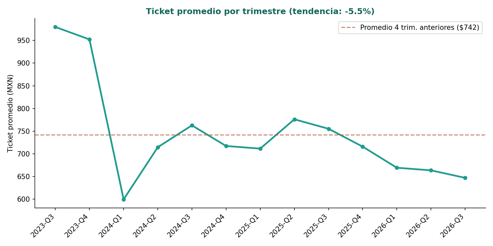

# Etapa 7 — Definición y Cálculo de KPI

**Proyecto:** IKAL — Marketplace de artesanías de Xicotepec de Juárez y Pantepec
**Elaboró:** María del Rosario Maldonado Hilario (230438)
**Código fuente:** [`src/analysis/kpis_analisis.py`](../src/analysis/kpis_analisis.py)
**Resultados en bruto:** [`data/processed/kpis_resultados.json`](../data/processed/kpis_resultados.json)

---

## 1. Objetivos de negocio considerados

Los KPI de este catálogo se derivan directamente de los objetivos centrales del modelo de negocio de IKAL:

1. **Garantizar que no exista intermediario** que reduzca la ganancia del artesano
2. **Que el beneficio de la plataforma llegue a todos los artesanos**, no solo a unos cuantos
3. **Ampliar el mercado más allá del comprador turístico** de temporada
4. **Reducir la pérdida de pedidos** por cancelación
5. **Incrementar los ingresos** de forma sostenida
6. **Sostener la rentabilidad** en todas las categorías de producto, no solo en algunas

## 2. Catálogo de KPI

| # | Nombre | Objetivo | Fórmula | Fuente | Periodicidad | Meta | Alerta | Valor actual | Semáforo |
|---|---|---|---|---|---|---|---|---|---|
| 1 | Margen promedio del artesano | Sin intermediarios | (precio_venta − costo) / precio_venta | `productos_corregido.csv` | Mensual | ≥ 55% | < 50% | **61.2%** | 🟢 |
| 2 | % de artesanos activos | Beneficio equitativo | artesanos con ≥1 venta neta / total de artesanos | `artesanos_corregido.csv` + `ventas_corregido.csv` | Mensual | ≥ 90% | < 80% | **86.7%** (52/60) | 🟡 |
| 3 | % de ventas fuera de la región | Alcance más allá del turismo | ventas a compradores fuera de Xicotepec/Pantepec / ventas totales | `ventas_corregido.csv` | Mensual | ≥ 70% | < 50% | **84.2%** | 🟢 |
| 4 | Tasa de cancelación | Reducir pérdida de pedidos | pedidos cancelados / pedidos totales | `ventas_corregido.csv` | Semanal | ≤ 5% | > 8% | **6.7%** | 🟡 |
| 5 | Tendencia del ticket promedio | Incrementar ingresos | variación % del ticket promedio, últimos 4 trimestres vs. 4 anteriores | `ventas_corregido.csv` | Trimestral | Crecimiento | Caída > 3% | **-5.5%** | 🔴 |
| 6 | Margen promedio por categoría | Rentabilidad sostenida | promedio de margen de productos de cada categoría | `productos_corregido.csv` | Mensual | ≥ 55% en todas | Cualquier categoría < 50% | **58%–64%** en todas | 🟢 |

**Responsable sugerido de revisión:** administración de Marca IKAL (grupo fundador), con reporte mensual al equipo completo.

## 3. Diferenciación métrica vs. KPI

Para evitar el error que señala la guía ("mostrar únicamente ventas totales" o "crear indicadores sin fórmula"), se distinguió explícitamente:

| Métrica (dato crudo) | KPI (indicador con objetivo) |
|---|---|
| Número de ventas totales (3,614) | % de ventas fuera de la región (84.2%) |
| Ingreso total ($2,411,947.83 neto) | Tendencia del ticket promedio (-5.5%) |
| Número de artesanos registrados (60) | % de artesanos activos (86.7%) |

## 4. Detalle de cada KPI

### 4.1 Margen promedio del artesano — 🟢 61.2%
Confirma que el modelo "sin intermediarios" se sostiene: el artesano conserva más de 6 de cada 10 pesos del precio final. Ver detalle completo en la Etapa 6.

### 4.2 % de artesanos activos — 🟡 86.7% (52 de 60)
8 artesanos registrados no generaron ningún ingreso neto. No llega a la meta de 90%, aunque tampoco está en zona de alerta (< 80%). Es el mismo hallazgo detallado en la Etapa 6, ahora expresado como indicador de seguimiento continuo.

### 4.3 % de ventas fuera de la región — 🟢 84.2%
Supera ampliamente la meta de 70%. La estrategia de venta digital hacia otras ciudades del país está funcionando de forma consistente.

### 4.4 Tasa de cancelación — 🟡 6.7%
Por encima de la meta (≤5%) pero por debajo del umbral de alerta (>8%). Instagram es el canal con mayor tasa de cancelación (7.9%, ver Etapa 6), un buen punto de partida para investigar la causa.

### 4.5 Tendencia del ticket promedio — 🔴 -5.5%

*Gráfica 1. Ticket promedio por trimestre (2023-Q3 a 2026-Q3). La línea punteada marca el promedio de los 4 trimestres previos a los últimos 4 completos.*

Este es el único KPI en semáforo rojo. El ticket promedio pasó de un promedio de $741.90 MXN (en el bloque de 4 trimestres anterior) a $700.98 MXN (en los últimos 4 trimestres completos), una caída de 5.5%. No es una caída abrupta, pero sí sostenida — vale la pena investigar si se debe a mayor proporción de productos de menor precio, a descuentos, o a cambios en el mix de categorías vendidas.

### 4.6 Margen promedio por categoría — 🟢 todas ≥55%

| Categoría | Margen promedio |
|---|---|
| Aretes | 64.0% |
| Accesorio | 62.9% |
| Bolsa | 61.9% |
| Blusa | 60.4% |
| Bordado | 60.0% |
| Playera | 58.1% |

Ninguna categoría cae debajo del umbral de alerta (50%). Playera es la de menor margen relativo, aunque sigue siendo saludable.

## 5. Limitaciones

- Los umbrales de meta y alerta se definieron con criterio razonado a partir del objetivo de negocio declarado por el equipo, no provienen de un benchmark de la industria de e-commerce artesanal en México, que no fue posible obtener para este proyecto.
- El KPI de tendencia de ticket promedio compara bloques de 4 trimestres; con series más largas de datos reales convendría aplicar una prueba estadística de tendencia en vez de una comparación simple de promedios.
- Los mismos límites señalados en la Etapa 6 aplican aquí (dataset simulado, periodo de 2.95 años).

## 6. Conexión con el diagnóstico (Etapa 10)

Este catálogo alimenta directamente el diagnóstico del equipo:
- El único semáforo rojo (ticket promedio) es la alerta más urgente a explicar en el diagnóstico.
- Los dos semáforos amarillos (artesanos activos, cancelación) están relacionados con hallazgos ya documentados en la Etapa 6 (artesanos inactivos, cancelaciones por canal) — no son problemas nuevos, son la misma causa vista desde el indicador de seguimiento.
