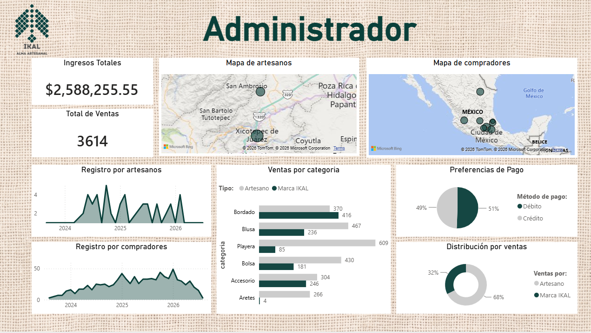

# Etapa 8: Dashboard del Dueño del Negocio

## 8.1 Definición del Usuario (Administración)
* **Qué decisiones toma:** Optimización de presupuestos de marketing digital, redirección de tráfico hacia los canales más rentables, planeación de inventarios estacionales y estrategias de apoyo directo a los artesanos de la región (Xicotepec y Veracruz).
* **Qué información necesita:** Ingresos totales acumulados, volumen de ventas, ticket promedio por canal de adquisición, rentabilidad y estatus logístico de los pedidos.
* **Con qué frecuencia consulta los datos:** Revisión operativa semanal y análisis financiero estratégico de forma mensual.
* **Qué nivel de detalle requiere:** Agregado y filtrable (capacidad de ver el panorama general del negocio pero con la opción de segmentar por región, canal o fecha).
* **Qué alertas son importantes:** Alertas tempranas por caída repentina de conversiones, aumento en la tasa de cancelaciones o niveles críticos de inventario en los productos más vendidos.

## 8.2 Elaboración del Diseño (Wireframes, Mockups y Prototipo)
* **Sketch y Wireframe:** Se diseñó un esquema estructural de alta visibilidad (tipo *Executive Dashboard*), dividiendo la pantalla principal en tres bloques lógicos:
  1. *Fila Superior (KPIs Globales):* Tarjetas de resumen rápido con Ingresos Totales, Pedidos y Ticket Promedio.
  2. *Bloque Central (Análisis de Negocio):* Gráficas de barras comparativas por canal de venta (Web, Redes Sociales) y evolución temporal de la demanda.
  3. *Bloque Inferior (Alertas y Filtros):* Panel lateral de filtros interactivos y tarjetas de alertas automáticas del sistema.
* **Mockup y Prototipo:** Desarrollado utilizando una paleta de colores limpia (inspirada en la identidad visual de IKAL con tonos sobrios y contrastes en verde/azul para destacar los indicadores clave de rendimiento).

## 8.3 Organización de la Información
El panel del dueño incorpora los siguientes componentes analíticos estructurados:
* **KPI Principales:** Ingresos totales ($1.04M+ MXN), total de transacciones y ticket promedio.
* **Ventas y Rendimiento por Canal:** Visualización clara de que la plataforma Web lidera las conversiones frente a canales conversacionales.
* **Tendencia Temporal y Estacionalidad:** Gráfica de línea que expone los picos de consumo de la segunda mitad de año (coincidiendo con festividades de temporada).
* **Alertas y Filtros:** Módulos dedicados a reportar anomalías operativas de forma inmediata.

## 8.4 Incorporación de Interacción (Filtros)
El dashboard es totalmente interactivo y cuenta con los siguientes filtros dinámicos en la barra superior:
* **Fecha:** Selector por rangos temporales (mes, año o histórico completo).
* **Canal:** Segmentación entre Web, Facebook, Instagram y WhatsApp.
* **Región / Ubicación:** Filtro por zonas de destino de los compradores (ej. CDMX, Puebla, Veracruz).

## 8.5 Integración de Alertas de Negocio
Se configuraron reglas de negocio visuales para advertir al administrador ante escenarios críticos:
* **Aumento de Cancelaciones:** Aviso en pantalla si el porcentaje de pedidos cancelados supera el umbral esperado.
* **Disminución de Ventas:** Alerta comparativa si el rendimiento semanal cae por debajo de la media móvil.

## Pregunta Principal de Negocio
* **¿Qué está ocurriendo?** Las ventas muestran un crecimiento sostenido con una marcada estacionalidad hacia el cierre de año y una preferencia absoluta de los usuarios por el canal Web.
* **¿Por qué está ocurriendo?** La confianza en la plataforma digital y las festividades de temporada impulsan la adquisición de piezas únicas bordadas.
* **¿Qué decisión debería tomar el negocio?** Destinar el 70% del presupuesto de marketing digital a potenciar el tráfico directo al sitio Web y coordinarse con los artesanos locales desde el mes de agosto para asegurar el stock ante el incremento de demanda.

