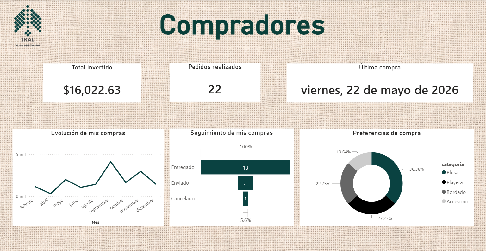
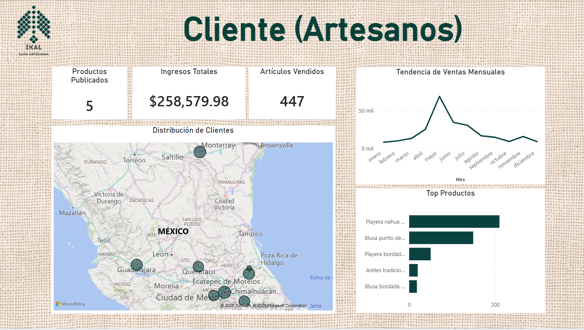

# Etapa 9: Dashboards del Cliente"

## 9.1 Definición de la Doble Perspectiva de Cliente
Para el modelo de negocio de IKAL (plataforma de conexión digital para artesanos), la gestión de usuarios abarca dos roles clave que interactúan en el ecosistema digital:
1. **El Comprador Final:** Requiere visibilidad de su inversión personal, control de sus pedidos y desglose de sus preferencias de moda artesanal.
2. **El Cliente-Artesano:** Requiere un panel de control operativo para medir el rendimiento de sus piezas expuestas, ingresos generados y distribución geográfica de sus compradores.

## 9.2 Diseño de Visualizaciones Personalizadas

### A. Dashboard del Comprador (E-commerce)
* **Métricas Clave (KPIs):** Total invertido ($16,022.63 MXN), Pedidos realizados (22) y Fecha de la última compra.
* **Componentes Visuales:**
  * *Evolución de mis compras:* Gráfica de línea temporal del gasto mensual.
  * *Seguimiento de pedidos:* Gráfica de embudo/flujo que desglosa el estatus logístico (Entregados, Enviados, Cancelados).
  * *Preferencias de compra:* Gráfica de anillos que muestra el porcentaje de interés por categorías (Blusas, Playeras, Bordados, Accesorios).

### B. Dashboard del Cliente-Artesano (B2B / Operativo)
* **Métricas Clave (KPIs):** Productos publicados (5), Ingresos totales generados ($258,579.98 MXN) y Artículos vendidos (447).
* **Componentes Visuales:**
  * *Distribución Geográfica:* Mapa interactivo de México con la ubicación de sus compradores ponderada por volumen.
  * *Tendencia de Ventas Mensuales:* Comportamiento de salida de inventario a lo largo del año.
  * *Top Productos:* Ranking de las artesanías más vendidas (ej. Playera nahua, Blusa punto de cruz).

## 9.3 Reglas de Protección y Privacidad de la Información
Para cumplir estrictamente con los estándares éticos y legales requeridos:
* **Aislamiento de Sesión:** Cada cliente accede exclusivamente a sus propios registros mediante su identificador cifrado (`comprador_id` o `artesano_id`), asegurando que jamás se expongan datos de terceros.
* **Cero Datos Sensibles:** Los tableros omiten por completo información financiera privada, credenciales de acceso o datos de localización particular de otros usuarios.